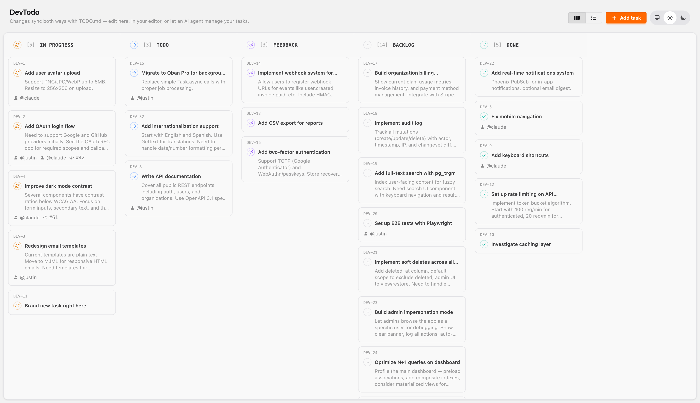
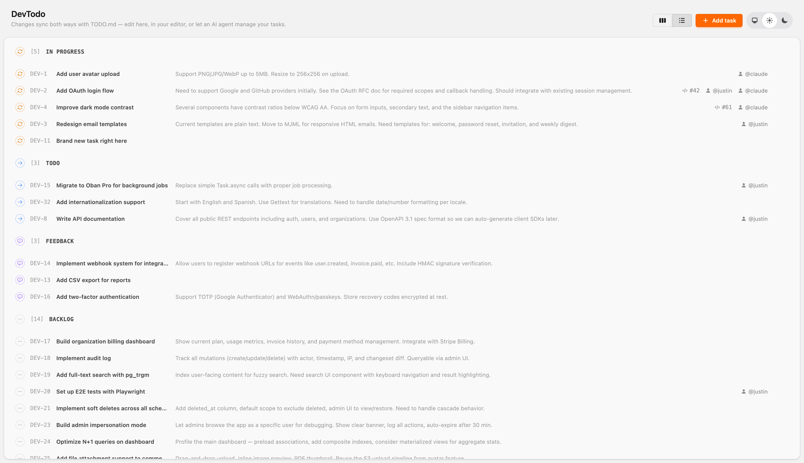

# DevTodo

A file-backed Kanban board for Elixir projects. Your `TODO.md` is the source of truth — a web UI provides board and list views, and a file watcher updates the UI in realtime when the file is edited externally (by you, an AI agent, or anyone else).

No database. No migrations. Just a markdown file.

<p>
  
  
</p>

## Features

- Board and list views with drag-and-drop reordering
- Realtime file watching — edit `TODO.md` in your editor and the board updates instantly
- Dynamic statuses derived from `## Heading` sections
- Task metadata: assignees (`@user`), PR links (`#pr:123`), attachments (`^path/to/file`)
- Task detail pages with markdown descriptions
- Auto-incrementing IDs with configurable prefix (`DEV-1`, `DEV-2`, ...)
- GitHub integration (links to PRs and assignee profiles)
- Dark/light/system theme toggle
- Parse warnings for malformed lines (resilient to bad edits)
- Ships as a mountable route (like LiveDashboard) — no asset config needed

## Getting Started

### 1. Add the dependency

```elixir
# mix.exs
def deps do
  [
    {:dev_todo, "~> 0.1.0", only: :dev}
  ]
end
```

Since DevTodo is a development tool, `only: :dev` ensures it won't be included in production releases.

### 2. Run the setup task

```bash
mix dev_todo.init
```

This will:
- Create a starter `TODO.md` in your project root
- Add configuration to `config/dev.exs`
- Print instructions for the supervision tree and router entries

### 3. Manual setup (if you prefer)

Add to your `config/dev.exs`:

```elixir
config :dev_todo,
  pubsub: MyApp.PubSub
```

Add to your supervision tree in `application.ex`:

```elixir
children = [
  # ... your children
  DevTodo.Supervisor,
  MyAppWeb.Endpoint
]
```

Add to your router:

```elixir
import DevTodo.Router

# Inside your dev_routes block
scope "/dev" do
  pipe_through :browser
  dev_todo "/todo"
end
```

That's it — DevTodo ships its own JavaScript, CSS, and root layout. No changes to your `app.js` or `app.css` needed.

### 4. Visit the board

Start your server and navigate to `/dev/todo`.

## TODO.md Format

```markdown
<!--
TODO.md — Project Task Board

- Prefix: DEV

Rules for AI agents editing this file:
- Sections are defined by ## headings (e.g., ## In Progress, ## Todo)
- Task format: `- [N] Task title @assignee #pr:123`
- IDs are auto-incrementing integers
- To move a task, cut the line and paste under the target section
- Order within a section = priority (top = highest)
-->

## In Progress

- [1] Add OAuth login flow @justin #pr:42
  Need to support Google and GitHub providers.
  See RFC doc for scope requirements.

## Todo

- [2] Redesign email templates

## Backlog

## Done

- [3] Set up CI pipeline @justin #pr:38
```

## Configuration

| Key           | Default      | Description              |
|---------------|-------------|--------------------------|
| `:pubsub`     | *required*  | Your app's PubSub module |
| `:todo_path`  | `"TODO.md"` | Path to the TODO.md file |
| `:dev`        | `false`     | Serve assets from disk at runtime (for library development) |

## Statuses

Statuses are derived from `## Heading` sections in your TODO.md — add any heading you like and the board adapts automatically. The following statuses have custom icons and colors built in:

| Heading | Icon | Color | Atom |
|---|---|---|---|
| **Default** | | | |
| `## In Progress` | arrow-path | yellow | `:in_progress` |
| `## Todo` | arrow-right | blue | `:todo` |
| `## Backlog` | ellipsis | neutral | `:backlog` |
| `## Done` | check | green | `:done` |
| **Review & Feedback** | | | |
| `## Review` | eye | purple | `:review` |
| `## Feedback` | chat-bubble | violet | `:feedback` |
| `## Approved` | thumb-up | emerald | `:approved` |
| **Planning & Ideation** | | | |
| `## Ideas` | light-bulb | amber | `:ideas` |
| `## Planning` | map | sky | `:planning` |
| `## Design` | paint-brush | pink | `:design` |
| **Testing & QA** | | | |
| `## Testing` | beaker | cyan | `:testing` |
| `## QA` | clipboard-check | teal | `:qa` |
| **Issue States** | | | |
| `## Blocked` | no-symbol | red | `:blocked` |
| `## Bug` | bug-ant | red | `:bug` |
| `## Urgent` | fire | rose | `:urgent` |
| **Workflow** | | | |
| `## Ready` | rocket-launch | lime | `:ready` |
| `## On Hold` | pause | orange | `:on_hold` |
| `## Cancelled` | x-mark | muted | `:cancelled` |
| `## Archived` | archive-box | muted | `:archived` |

Any heading not listed above gets a neutral dash icon. Headings are converted to atoms by downcasing and replacing spaces with underscores (e.g., `## In Progress` becomes `:in_progress`).

## Router Options

```elixir
dev_todo "/todo",
  root_layout: {MyAppWeb.Layouts, :custom_root},  # optional custom root layout
  on_mount: [MyAppWeb.Auth],                      # optional on_mount hooks
  as: :my_todo                                    # optional live_session name
```

## Development

### Prerequisites

- Elixir ~> 1.19

### Setup

```bash
cd dev_todo
mix setup
```

Phoenix JS deps (`phoenix.js`, `phoenix_live_view.js`) are loaded from their OTP application directories at compile time by `DevTodo.Web.Assets` — same approach as LiveDashboard. JS dependencies (Sortable.js, `@phx-hook/sortable`) are installed via npm and bundled by esbuild into `dist/`. The vendor directory (`assets/vendor/`) contains Tailwind plugins (daisyUI, heroicons).

If you're working on asset changes, also run:

```bash
cd assets && npm install
```

### Building assets

DevTodo ships pre-built bundles in `dist/`. After changing anything in `assets/`, rebuild:

```bash
mix assets.build
```

This runs esbuild (JS) and tailwind (CSS) via their hex packages — binaries are downloaded automatically on first run. The JS bundle (~39kb) contains Sortable.js and the `@phx-hook/sortable` hook; Phoenix and LiveView JS are concatenated at compile time from their OTP app dirs.

The built files in `dist/` are committed and embedded into the `DevTodo.Web.Assets` module at compile time. In production (default), assets are served from the compiled module with immutable cache headers.

### Developing with a host Phoenix app

Reference as a path dep in your host app's `mix.exs`:

```elixir
{:dev_todo, path: "../dev_todo", only: :dev}
```

For a fast dev pipeline with automatic reloading, add to your host app's `config/dev.exs`:

```elixir
# Enable runtime asset serving (reads dist/ from disk on each request)
config :dev_todo, dev: true

# Recompile dev_todo when its source files change
config :my_app, MyAppWeb.Endpoint,
  reloadable_apps: [:my_app, :dev_todo]

# Watch dev_todo directory for live reload
config :phoenix_live_reload, :dirs, [
  "",
  Path.expand("../dev_todo")
]

# Auto-rebuild dev_todo assets on change (add to existing watchers)
config :my_app, MyAppWeb.Endpoint,
  watchers: [
    # ... your existing watchers ...
    esbuild: {Esbuild, :install_and_run, [:dev_todo, ~w(--watch)]},
    tailwind: {Tailwind, :install_and_run, [:dev_todo, ~w(--watch)]}
  ]

# Build profiles for dev_todo assets
config :esbuild,
  dev_todo: [
    args: ~w(js/app.js --bundle --target=es2020 --outdir=../dist/js),
    cd: Path.expand("../dev_todo/assets")
  ]

config :tailwind,
  dev_todo: [
    args: ~w(--input=css/app.css --output=../dist/css/app.css),
    cd: Path.expand("../dev_todo/assets")
  ]
```

With this setup, editing any `.ex` file or asset in dev_todo will automatically recompile and reload the browser — no manual rebuilds or restarts needed.
